<div align="center">

# PlacementOS

### AI-assisted placement preparation, unified into one operating system

PlacementOS connects DSA practice, resume intelligence, interview replay, readiness scoring, daily planning, and smart notifications into a single preparation workflow.

</div>

---

## Product Preview

<table>
  <tr>
    <td width="33%"></td>
    <td width="33%"></td>
    <td width="33%"></td>
  </tr>
  <tr>
    <td align="center"><b>Landing</b></td>
    <td align="center"><b>Authentication</b></td>
    <td align="center"><b>Readiness Dashboard</b></td>
  </tr>
  <tr>
    <td></td>
    <td></td>
    <td></td>
  </tr>
  <tr>
    <td align="center"><b>DSA Tracker</b></td>
    <td align="center"><b>Resume Intelligence</b></td>
    <td align="center"><b>Interview Replay</b></td>
  </tr>
  <tr>
    <td></td>
    <td></td>
    <td></td>
  </tr>
  <tr>
    <td align="center"><b>Progress Analytics</b></td>
    <td align="center"><b>Full-Stack Roadmap</b></td>
    <td align="center"><b>Replay Analysis</b></td>
  </tr>
</table>

---

## Overview

Engineering students usually prepare for placements using disconnected tools: coding platforms for DSA, document tools for resumes, generic interview platforms, spreadsheets for progress tracking, and calendars for reminders. Each tool records activity, but none maintains a unified understanding of the student's preparation state.

PlacementOS solves this coordination problem by treating preparation activity as connected evidence. DSA performance, resume quality, interview outcomes, revision history, target companies, and consistency signals contribute to one readiness model and one prioritized action system.

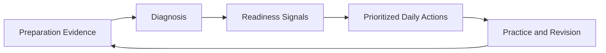

The product is designed as a continuous feedback loop: every action updates the student's preparation model and influences what the system recommends next.

---

## Core Product Modules

| Module | What it provides | Engineering role |
|---|---|---|
| Authentication and Profile | Email/password login, Google authentication, verification, roles, skills, target companies | Identity boundary and personalization context |
| DSA Tracker v2 | Topic, pattern, difficulty, status, revision dates, company tags, notes | Structured learning evidence and weak-area analytics |
| Resume Intelligence | Upload, ATS analysis, structured recommendations, freshness tracking | Document evidence and readiness contribution |
| Interview Replay | Manual/audio/video input, transcription, question replay, AI diagnosis | High-value feedback and media/AI pipeline |
| Readiness Engine | Cross-domain score and readiness history | Shared preparation diagnosis |
| Daily Plan and Roadmap | Bounded preparation tasks and progress-aware planning | Action orchestration |
| Smart Notifications | Real-time completion events and preference-aware reminders | Re-engagement and system feedback |
| Settings and Feedback | Notification preferences, timezone, support, account controls | User control and operational feedback |

---

## Key Capabilities

**Authentication and Identity** — Email and password authentication, Google authentication through Firebase, backend verification of Firebase identity tokens, email verification workflow, JWT access and refresh sessions, role-aware authorization, protected routes with user-scoped data access, and Telegram alerts for authentication events.

**DSA Tracker v2** — Manual problem tracking with topic and pattern classification, difficulty and completion status, platform links and company tags, solve count and revision scheduling, notes and learning history, weak-topic identification, pattern-coverage analytics, a revision queue, and readiness-score contribution.

**Resume Intelligence** — Resume upload and storage, ATS-oriented analysis, structured improvement feedback, resume freshness tracking, role-fit and readiness signals, dashboard score integration, and real-time analysis-completion notifications.

**Interview Replay** — Manual, audio, and video interview input; browser-side video-to-audio extraction; adaptive single-file or chunked upload; sequential transcription; boundary-aware transcript reconstruction; structured AI analysis; question-level candidate-answer evaluation; expected-answer checklists; missed points and likely knowledge gaps; root-cause analysis; practice tasks and revision plans; and interview-readiness contribution.

**Daily Planning and Notifications** — Personalized preparation plans with bounded daily tasks covering DSA, profile, resume, and interview actions; selected-task preservation during regeneration; real-time Socket.IO notifications; unread notification state; user-controlled notification preferences; timezone-aware digest configuration; and a protected automation endpoint for scheduled reminder evaluation.

---

## Readiness Engine

PlacementOS converts activity from multiple domains into one materialized readiness model.

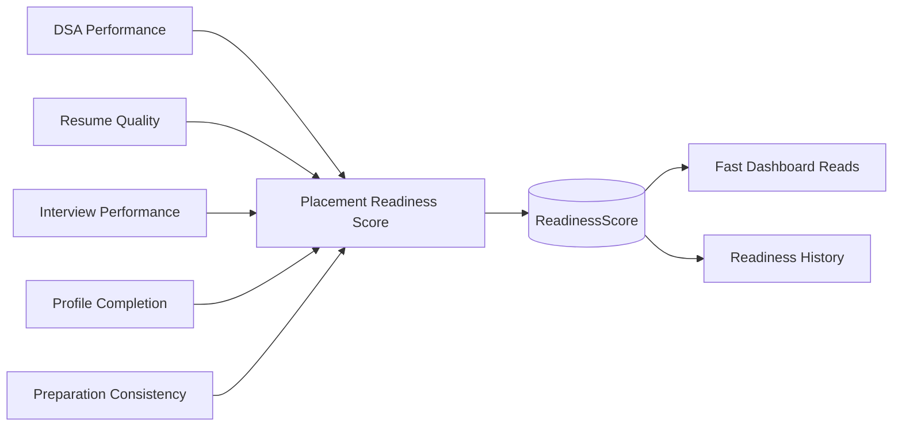

The aggregate is recalculated after relevant domain updates. This creates predictable dashboard performance while preserving a traceable history of readiness changes.

---

# System Architecture

PlacementOS uses a **domain-oriented modular-monolith architecture**.

The frontend and backend are deployed independently, while the backend remains one Node.js application with explicit boundaries around authentication, preparation evidence, AI analysis, readiness aggregation, notifications, and external integrations.

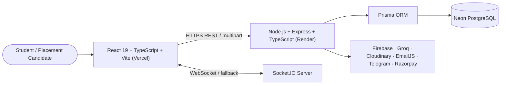

### Live Deployment

| Layer | Platform | Endpoint |
|---|---|---|
| Frontend | Vercel | [placement-os-kappa.vercel.app](https://placement-os-kappa.vercel.app) |
| Backend API | Render | [placementos-api-2acg.onrender.com](https://placementos-api-2acg.onrender.com) |
| Health Check | Render | [placementos-api-2acg.onrender.com/api/health](https://placementos-api-2acg.onrender.com/api/health) |
| Database | Neon PostgreSQL | Managed production database |
| Media | Cloudinary | Managed object storage |
| Identity | Firebase + PlacementOS JWT | Federated and first-party authentication |
| AI | Groq | Transcription and structured analysis |

A full engineering study can be kept at:

```text
docs/architecture/PlacementOS_Complete_Architecture_Blueprint.pdf
```

---

## Architectural Style

The modular-monolith design was selected because PlacementOS has strongly connected relational data, shared readiness calculations, cross-domain workflows, one primary engineering owner, moderate current traffic, and no immediate requirement for independently scaled microservices. This structure avoids premature operational complexity while preserving clear extraction paths for future workers, queues, and distributed services.

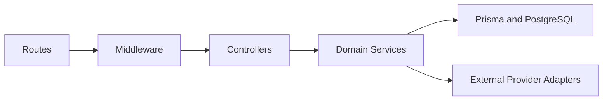

---

## Frontend Architecture

The frontend is a React single-page application built with TypeScript and Vite.

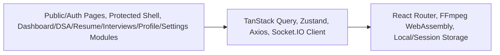

### Frontend Responsibilities

| Area | Responsibility |
|---|---|
| Routing | Public, authenticated, and protected route orchestration |
| Server state | Caching, invalidation, loading, and error handling |
| Client state | Authentication and local UI state |
| API communication | Bearer-token injection and centralized request configuration |
| Real time | Live notification delivery and unread-state updates |
| Media preprocessing | Local audio extraction and chunk preparation |
| Responsive UI | Desktop shell, mobile layouts, and touch-safe controls |
| Accessibility | Focus states, semantic structure, reduced-motion support, explicit status messaging |

### Design System

The UI follows a dark navy and charcoal visual system with indigo-violet accents, rounded surfaces, subtle borders and glows, responsive spacing, accessible focus states, reduced-motion support, and explicit loading, success, and error feedback.

---

## Backend Architecture

The backend is organized into layered modules with domain-specific services.

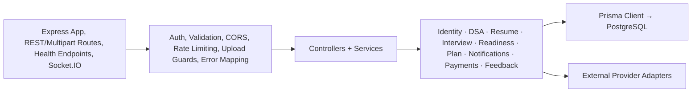

### Backend Design Principles

Controllers remain thin and delegate business rules to services. User ownership is enforced through user-scoped queries. Cross-domain readiness updates are centralized. External providers are accessed through service boundaries. AI output is validated and normalized before persistence. Provider failures are mapped to stable HTTP responses. Sensitive credentials remain server-side. Interview processing is protected by retry, queue, and duplicate-work controls.

---

## Data Architecture

Neon PostgreSQL is the system of record, accessed through Prisma ORM.

### Core Entities

| Entity | Purpose |
|---|---|
| `User` | Identity, role, authentication state, ownership root |
| `Profile` | Skills, target companies, college, biography, social links |
| `DSAProblem` | Problem metadata, topic, pattern, difficulty, status, notes |
| `DSARevision` | Revision scheduling and revision history |
| `Resume` | Uploaded document, score, analysis, and freshness metadata |
| `InterviewSession` | Source, transcript, analysis, score, and workflow status |
| `InterviewQuestionReplay` | Question-level candidate answer and AI feedback |
| `ReadinessScore` | Materialized cross-domain readiness aggregate |
| `ReadinessHistory` | Historical readiness changes |
| `DailyPlan` | Generated tasks and completion state |
| `Streak` | Preparation consistency |
| `Notification` | In-app and email notification record |
| `NotificationPreference` | Digest, timezone, and reminder settings |
| `Feedback` | User feedback and bug reports |
| `Payment` | Premium-payment records |

### Entity Relationships

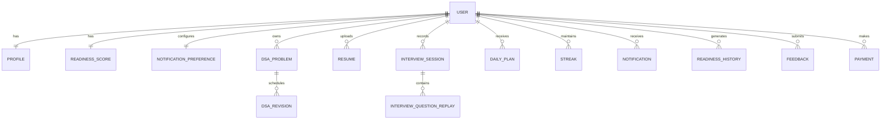

### Data-Modeling Principles

Every preparation record is tied to its owner. One-to-one aggregates use stable upsert semantics. Enum-backed fields constrain critical workflow states. Readiness is materialized for predictable dashboard reads. Interview AI output is stored as structured product data. Prisma migrations preserve schema history across environments.

---

## Critical Workflows

### Authentication

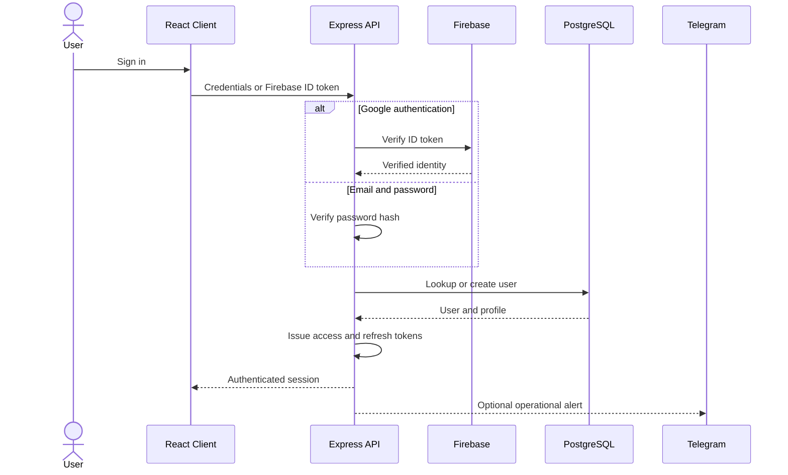

The backend verifies Google identity server-side before issuing PlacementOS tokens.

### Interview Replay and AI Pipeline

```mermaid
flowchart LR
    INPUT[Manual/Audio/Video Input] --> VALIDATE[Browser Validation] --> VIDEO{Video?}
    VIDEO -- Yes --> EXTRACT[FFmpeg Extracts Audio] --> SIZE[Evaluate Audio Size]
    VIDEO -- No --> AUDIO[Use Provided Audio] --> SIZE
    SIZE --> CHUNK{Chunking Required?}
    CHUNK -- No --> SINGLE[Single Upload] --> SERVER[Backend Validation]
    CHUNK -- Yes --> PARTS[Ordered Overlapping Chunks] --> SERVER
    SERVER --> TRANSCRIBE[Sequential Groq Transcription] --> COMBINE[Boundary-Aware Merge] --> ANALYZE[Structured AI Analysis]
    ANALYZE --> PERSIST[Persist Session and Replays] --> SCORE[Recalculate Readiness] --> EVENT[Emit Socket.IO Event]
```

### Resume Analysis

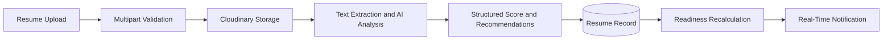

### Real-Time Notifications

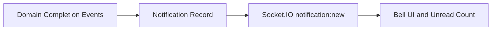

---

## AI and Media Engineering

The Interview Replay pipeline is one of the most technically significant parts of PlacementOS.

### Privacy-Aware Browser Processing

Original video is intentionally not uploaded. For video input, the browser validates the media, FFmpeg WebAssembly loads only when needed, audio is extracted locally and converted into a compressed transcription-compatible format, and the original video remains on the user's device. This reduces backend bandwidth, object-storage cost, unnecessary exposure of personal video, and provider upload-limit failures.

### Adaptive Upload Strategy

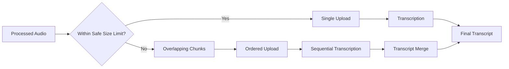

### AI Output Contract

The AI layer produces structured output containing overall and category-level scores, strengths and weaknesses, question-level candidate answers, expected-answer points, missed concepts, likely root causes, practice tasks, short revision plans, and company-readiness guidance. Responses are parsed, normalized, and range-checked before persistence.

---

## Technology Stack

| Layer | Technologies |
|---|---|
| Frontend | React 19, TypeScript, Vite, React Router, Tailwind CSS |
| Client State | Zustand, TanStack Query |
| Networking | Axios, Socket.IO Client |
| Browser Media | FFmpeg WebAssembly |
| Backend | Node.js, Express, TypeScript |
| Database | PostgreSQL, Prisma ORM |
| Authentication | JWT, bcrypt, Firebase Admin |
| AI | Groq SDK |
| Storage | Cloudinary |
| Email | EmailJS |
| Payments | Razorpay |
| Deployment | Vercel, Render, Neon |
| Tooling | GitHub, Vitest, TypeScript builds |

---

## External Integrations

| Integration | Responsibility |
|---|---|
| Neon | Production PostgreSQL hosting |
| Prisma | Typed ORM, migrations, and relational access |
| Render | Backend deployment |
| Vercel | Frontend deployment |
| Firebase | Google authentication and identity-token verification |
| Groq | Transcription and structured AI analysis |
| Cloudinary | Resume and processed-audio storage |
| EmailJS | Verification and notification email delivery |
| Socket.IO | Real-time in-app notifications |
| Telegram Bot API | Operational authentication alerts |
| Razorpay | Premium-payment integration |

---

## Security and Privacy

PlacementOS stores sensitive preparation data, including resumes, interview transcripts, scores, target companies, and profile information. Implemented controls include bcrypt password hashing, JWT-protected API routes, access and refresh token separation, backend verification of Firebase tokens, role-aware authorization, user-scoped database queries, production CORS restrictions, request validation, upload and duration limits, rate limiting, server-only provider credentials, environment-variable-based secret management, generic provider-error responses, and original-video exclusion by design.

The media architecture intentionally sends only processed audio required for transcription.

---

## Reliability and Failure Handling

PlacementOS includes resilience mechanisms beyond standard CRUD behavior: exponential backoff for retryable AI failures, provider `Retry-After` handling, explicit `429` and `503` response mapping, a serial transcription queue, a per-user interview-processing lock, duplicate-notification prevention, structured fallback parsing for malformed AI output, health and database-health endpoints, and production deployment checks.

### Current Scope

The queue and processing lock are process-local and appropriate for the current single-instance backend. Future horizontal scaling should introduce distributed locks, durable background jobs, shared provider-rate coordination, worker-based transcription and analysis, and structured execution history and metrics.

---

## Production Deployment

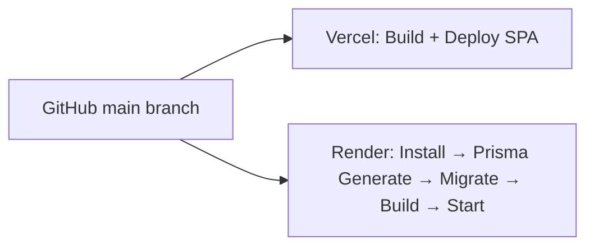

| Component | Deployment |
|---|---|
| Frontend | Vercel |
| Backend | Render |
| Database | Neon PostgreSQL |
| Media | Cloudinary |
| Authentication | Firebase + PlacementOS JWT |
| AI | Groq |
| Real-Time | Socket.IO |

---

## Repository Structure

```text
PlacementOS/
├── client/
│   ├── public/
│   ├── src/
│   │   ├── components/ features/ pages/ services/ store/ hooks/ layouts/ types/ utils/
│   ├── vercel.json
│   └── package.json
│
├── server/
│   ├── prisma/ migrations/ schema.prisma
│   ├── src/
│   │   ├── controllers/ routes/ middleware/ services/ validators/ prisma/ utils/
│   │   ├── app.ts
│   │   └── index.ts
│   └── package.json
│
├── docs/architecture/PlacementOS_Complete_Architecture_Blueprint.pdf
└── README.md
```

---

## Engineering Decisions

| Decision | Rationale | Current trade-off |
|---|---|---|
| Modular monolith | Preserves delivery speed and relational consistency | Process-local coordination |
| PostgreSQL and Prisma | Supports connected domain data and typed access | Migration and schema discipline |
| REST plus Socket.IO | Separates command/query requests from push events | Two communication models |
| Browser-side FFmpeg | Protects privacy and reduces backend bandwidth | Browser CPU and memory cost |
| Structured AI JSON | Converts probabilistic output into stable product data | Prompt and parser maintenance |
| Adaptive audio chunking | Handles provider upload limits transparently | More upload and merge logic |
| Materialized readiness score | Enables predictable dashboard reads | Additional write-time computation |
| Feature branches and atomic commits | Improves traceability and rollback safety | More disciplined Git workflow |

---

## Current Limitations

Interview transcription and analysis remain request-bound. Processing locks and the transcription queue are process-local. Large multipart uploads still use memory-backed handling. External-object deletion requires stronger reconciliation. Readiness calibration needs long-term outcome validation. Production observability currently relies mainly on application and platform logs. External scheduling for notification automation is optional and not required for core product usage.

---

## Future Engineering Roadmap

**Priority 0** — Add idempotency keys to upload and AI-analysis commands, add structured correlation IDs, enforce total multipart-byte limits, strengthen external-object deletion reconciliation, and expand end-to-end production tests.

**Priority 1** — Move transcription and analysis to durable background jobs, introduce distributed locks, add Redis-backed provider coordination, stream large uploads to object storage, add automation-run history and failure alerts, and add provider latency, retry, and success-rate metrics.

**Priority 2** — Version readiness formulas and AI prompt schemas, add per-user AI usage accounting, build an admin observability dashboard, and extract dedicated notification and media workers when load requires them.

---

## Project Status

PlacementOS is deployed as a production-style portfolio application with a live React frontend, a deployed Node.js API, managed PostgreSQL persistence, Firebase-backed Google authentication, AI-assisted resume and interview workflows, real-time notifications, responsive desktop and mobile interfaces, production health checks, and automatic deployments from GitHub.

The project demonstrates engineering beyond a standard CRUD application through privacy-aware media processing, provider resilience, cross-domain scoring, real-time events, relational modeling, and structured AI workflows.

---

## Architecture Documentation

Detailed architecture study:

```text
docs/architecture/PlacementOS_Complete_Architecture_Blueprint.pdf
```

---

## Author

**Aryan Jaiswal**

[GitHub — aryancodes12-bit](https://github.com/aryancodes12-bit)

Full-stack engineering · AI-assisted workflows · System design · Placement technology

---

## License

This project is licensed under the [MIT License](LICENSE).

Copyright (c) 2026 Aryan Jaiswal
